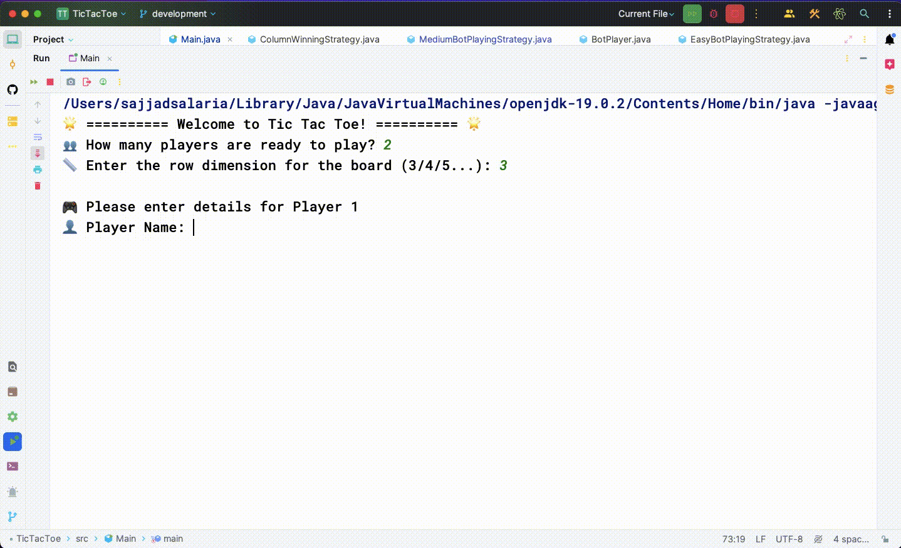

# Tic-Tac-Toe 🎮



## Overview 🌐

Tic-Tac-Toe is a classic 2-player game played on an NxN board. Each player, represented by a symbol (X or O), takes turns placing their symbol in an empty slot. The first player to form a complete row, column, or diagonal wins the game.

You can even play the game within Google Search by searching for "tictactoe"! 🕹️


## Problem Requirements 📋

- Board can be of any NxN size.

- Two players, each assigned a symbol (O or X).

- Players can be human or bot.

- Human players have a name, email, and profile image.

- Bot players have a difficulty level.

- The game starts with a random player.

- Players take turns playing alternatively.

- The player with any consecutive N symbols in a row, column, or diagonal wins.

- If the board is full and no player has won, the game is a draw.

## Questions to Consider ❓

- **Number of Players:** Will the game be played among only 2 players, or can there be any number of players in the future?

- **Board Size:** Is the board size restricted to 3x3, or can it be any NxN?

- **Winning Criteria:** Can there be different ways to win?

- **Bot Player:** Can one of the players be a bot?

## Feature Suggestions 🚀

- **Move Timing:** Should there be a time limit for each move? Can a player be declared the winner if the move doesn’t happen within x seconds?

- **Undo Operation:** Do we want to support an undo operation?

- **Spectators:** Can some players just watch without participating?

- **Analytics:** Do we want to store analytics, such as previous games and moves?

- **Tournaments:** Is there a need for tournament support with a set of matches between players?

## Expectations 🎯

- The code should be working and functionally correct.

- Follow good software design practices, including modularity, readability, and extensibility.

- Implement separation of concerns and structure the project well across multiple files/packages.

- Write unit tests to ensure code reliability.

- No need for a graphical user interface (GUI).

## Getting Started 🚀

1. Clone the repository:

   ```bash
   git clone https://github.com/xoraus/TicTacToe.git
   ```

2. Navigate to the project directory:
   ```bash
   cd tic-tac-toe
   ```

## Contribution Guidelines 🤝

Contributions are welcome! If you have any ideas or improvements, feel free to open an issue or submit a pull request.
